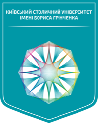

  

<h1 align="center">Borys Grinchenko Kyiv University (grinchenkoedu)</h1>

  
  

  <strong>Open Source Software and Educational Technology</strong> 
  <strong>Програмне забезпечення з відкритим вихідним кодом та освітні технології</strong>

---

## 🏛 About Us / Про нас

**[EN]** 
Welcome to the official GitHub organization of **Borys Grinchenko Kyiv University**. 
Our mission is to foster open-source development, collaborate on educational technology, and provide tools that empower students, educators, and the broader academic community in Ukraine and worldwide.

Our development primarily focuses on:
*   🎓 **E-Learning Enhancements:** Plugins and optimizations for Learning Management Systems like Moodle.
*   🔌 **API Integrations:** Seamless connections with essential services (e.g., Diia, StrikePlagiarism).
*   💻 **Student & Research Projects:** Collaborative academic software engineering.

 

**[UA]** 
Ласкаво просимо до офіційної GitHub організації **Київського столичного університету імені Бориса Грінченка**. 
Наша місія полягає у сприянні розробці програмного забезпечення з відкритим вихідним кодом, співпраці у сфері освітніх технологій та створенні інструментів, що допомагають студентам, викладачам та ширшій академічній спільноті в Україні та світі.

Наша розробка насамперед зосереджена на:
*   🎓 **Покращення електронного навчання:** Плагіни та оптимізації для систем управління навчанням, таких як Moodle.
*   🔌 **API Інтеграції:** Безшовне підключення до ключових сервісів (наприклад, Дія, StrikePlagiarism).
*   💻 **Студентські та дослідницькі проєкти:** Спільна академічна розробка програмного забезпечення.

---

## 🌟 Featured Projects / Популярні проєкти

*   **[local_cleanup](https://github.com/grinchenkoedu/local_cleanup):** 
    *   *(EN)* A robust Moodle plugin designed to optimize storage and database performance by identifying and removing unnecessary orphaned files, old submissions, and logs.
    *   *(UA)* Надійний плагін Moodle, призначений для оптимізації продуктивності сховища та баз даних шляхом пошуку та видалення непотрібних файлів-сиріт, старих робіт і логів.
*   **[diia-php](https://github.com/grinchenkoedu/diia-php):** 
    *   *(EN)* A PHP client for interacting with the Diia (Дія) API, facilitating digital state services integration.
    *   *(UA)* PHP-клієнт для взаємодії з API Дія, що сприяє інтеграції з державними цифровими сервісами.
*   **[strike-plagiarism-php](https://github.com/grinchenkoedu/strike-plagiarism-php):** 
    *   *(EN)* A PHP client wrapper for the StrikePlagiarism API v2, helping maintain academic integrity.
    *   *(UA)* Обгортка PHP-клієнта для API StrikePlagiarism v2, що допомагає підтримувати академічну доброчесність.

---

## 🤝 How to Contribute / Як долучитися

**[EN]** 
We welcome contributions from our students, faculty, and the global open-source community! 
1. Check the `Issues` tab on any of our repositories for active tasks.
2. Fork, commit, and submit a Pull Request.

**[UA]** 
Ми вітаємо внески від наших студентів, викладачів та світової спільноти open-source!
1. Перевірте вкладку `Issues` у будь-якому з наших репозиторіїв на наявність активних завдань.
2. Зробіть Fork, Commit та надішліть Pull Request.

---

## 📬 Contact & Links / Контакти та посилання
*   🌐 **Website / Вебсайт:** [kubg.edu.ua](https://kubg.edu.ua/)
*   📍 **Location / Розташування:** Kyiv, Ukraine / Київ, Україна

---

  <i>"Education is the most powerful weapon which you can use to change the world."</i> 
  <i>"Освіта – це найпотужніша зброя, яку ви можете використати, щоб змінити світ."</i>

